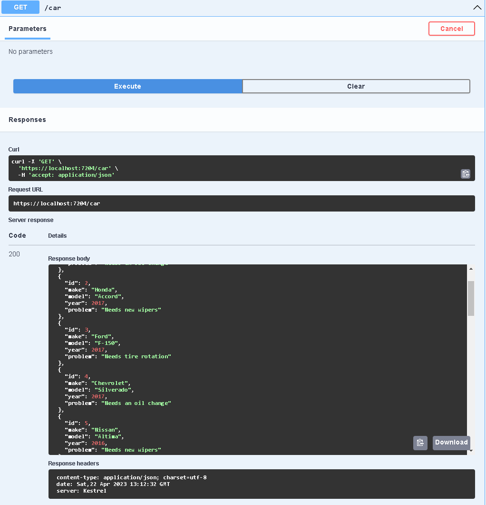
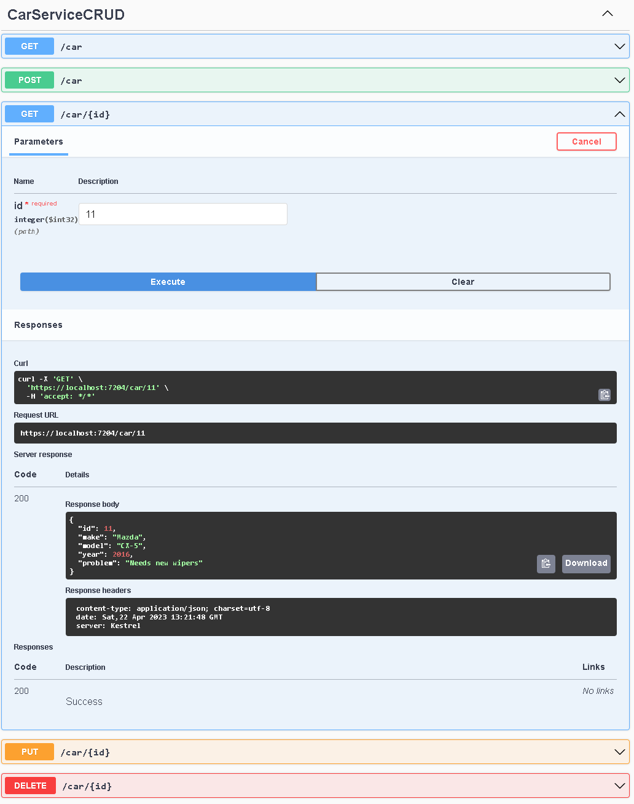
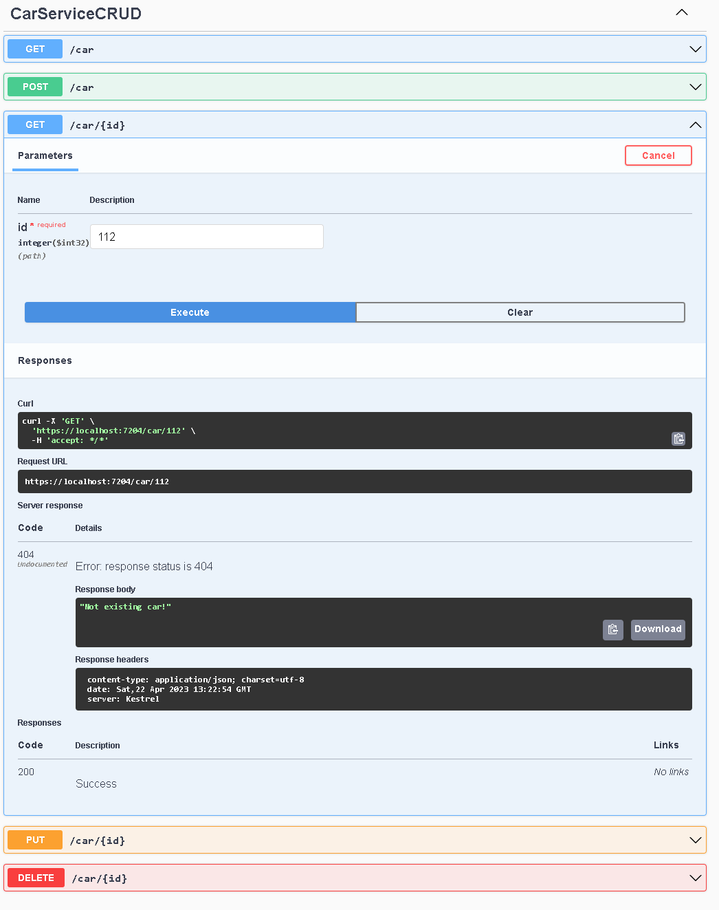
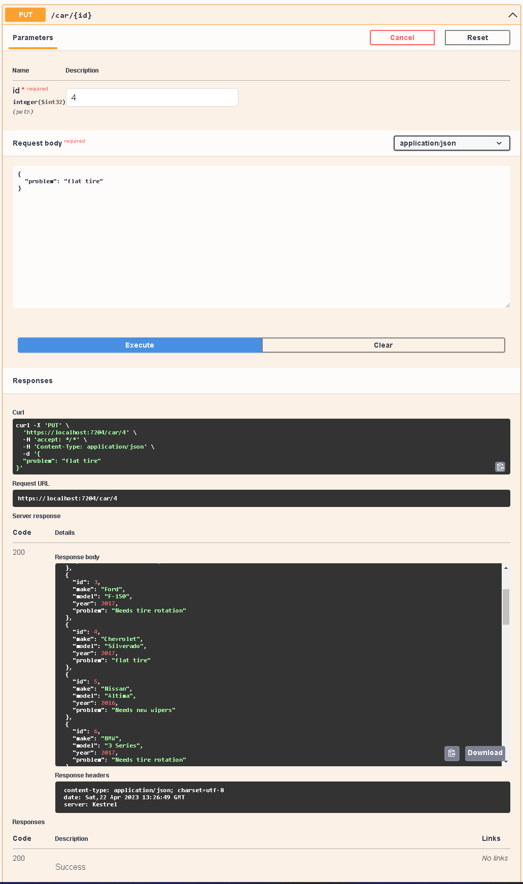
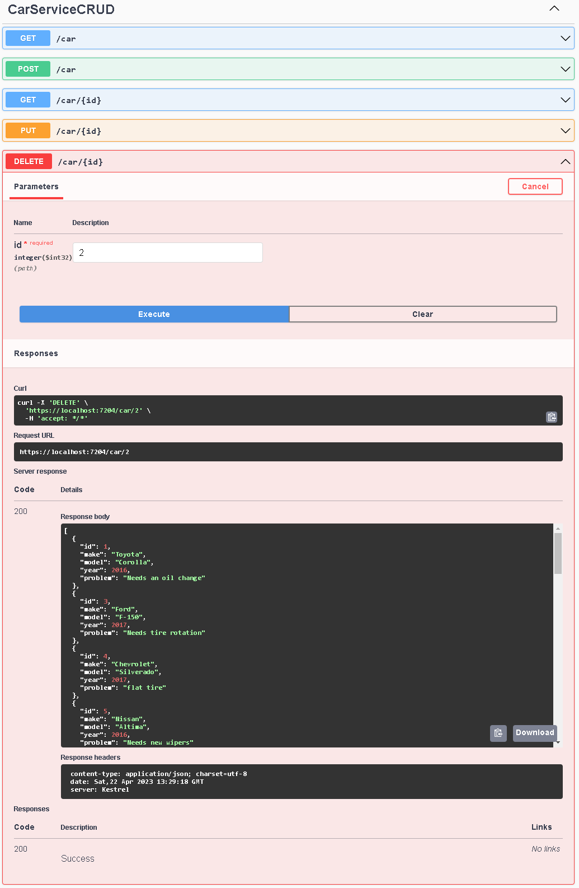

# CarServiceCRUD
Basic CRUD operations. Testing Minimal API. App represents list of cars about to be serviced/fixed in the workshop.

## Get all cars

## Get a car

## Non-existing car

 ## Update car's problem

 

 ## Delete a car by id
 

 ### This project was a test of Minimal API

 ## Conclusion after using

 - Simple and inituitive
 - Very easy to learn
 - Reduces boilerplate code